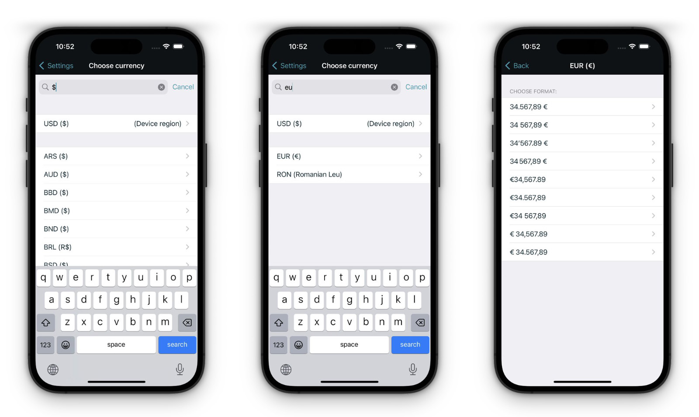

# stillwaitin-app Highlights

Here we highlight a few spots in the source code and the choices we made, while making the App.

We had lots of fun building it. We experimented & learned a lot. And it helped us improve, when we only started our careers. It even made us a few bucks. It's fun to see how much iOS development of today has evolved from the early days.

Enjoy exploring this window into the past.

## Custom Keyboard

We spent quite some time on refining the entry of currency values. The system number keyboard had its limitations, e.g. you couldn't control the size of it, nor could you add custom keys to it. So we created a custom keyboard to enable both.

We wanted to ensure it behaves as close to the system keyboard, as it could. E.g. you can start to tap on the wrong key, get highlighting and then drag over to another key without triggering any input. Only if you release your finger while a key is highlighted will you actually type. Further you could also hold-to-delete on the back button - just like the system keyboard.

Source Code: [`SWValueKeyboard.m`](https://github.com/calimarkus/stillwaitin-app/blob/main/2020_v2.4/Classes/Keyboard/SWValueKeyboard.m)

## Currency Selection

Starting in 2013 a user could choose any currency and its preferred formatting - independent of your device region settings.

Source Code: [`ChooseCurrencyViewController`](https://github.com/calimarkus/stillwaitin-app/blob/main/2020_v2.4/Classes/ChooseCurrencyViewController/ChooseCurrencyViewController.m):

## Dark Mode

In 2020 we added support for dark mode by introducing semantic colors.

Source Code: [`SWColors.h`](https://github.com/calimarkus/stillwaitin-app/blob/main/2020_v2.4/Classes/Helper/SWColors.h)

## Contacts Auto-Complete

To make entering new entries as easy as possible, we supported auto complete of contact names early on. With contact permissions, all contacts would auto complete. Without permissions we would still auto-complete based on currently existing entries or recently entered names.

Source Code: [`AddressBookUtility.h`](https://github.com/calimarkus/stillwaitin-app/blob/main/2020_v2.4/Classes/EnterPersonViewController/AddressBookUtility.h), [`EnterPersonViewController.m`](https://github.com/calimarkus/stillwaitin-app/blob/main/2020_v2.4/Classes/EnterPersonViewController/EnterPersonViewController.m)

## Dynamic list cell layout

We wanted to communicate most information right from the main list view. So it had to be very flexible in its layout for long and short descriptions, as well as big and small currency amounts. See the (very old-school) `layoutSubviews:` code enabling this below (yep, this ain't SwiftUI).

Source Code: [`EntryListEntryCell.m`](https://github.com/calimarkus/stillwaitin-app/blob/main/2020_v2.4/Classes/List/EntryListEntryCell.m#L172)

