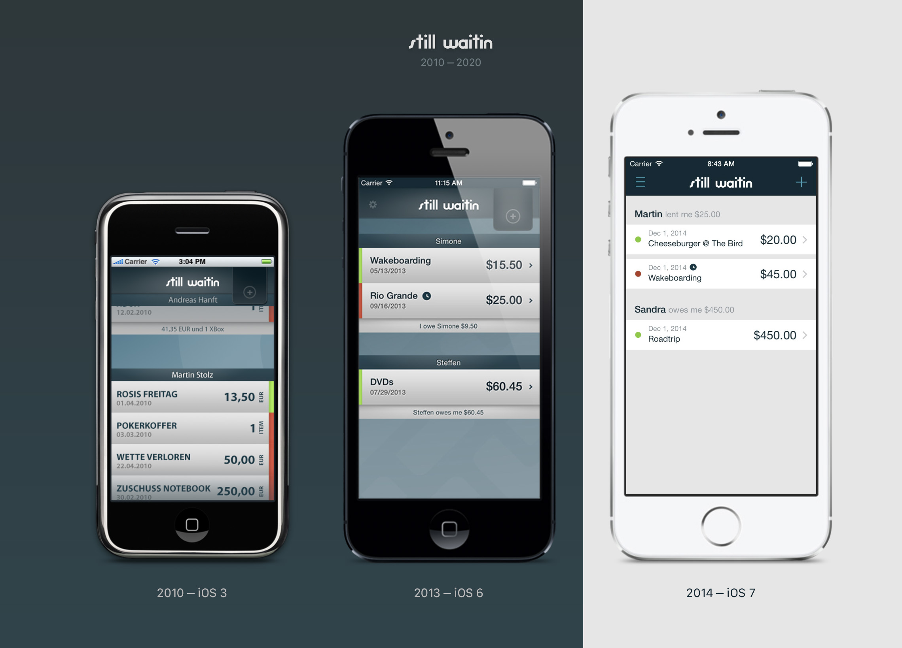
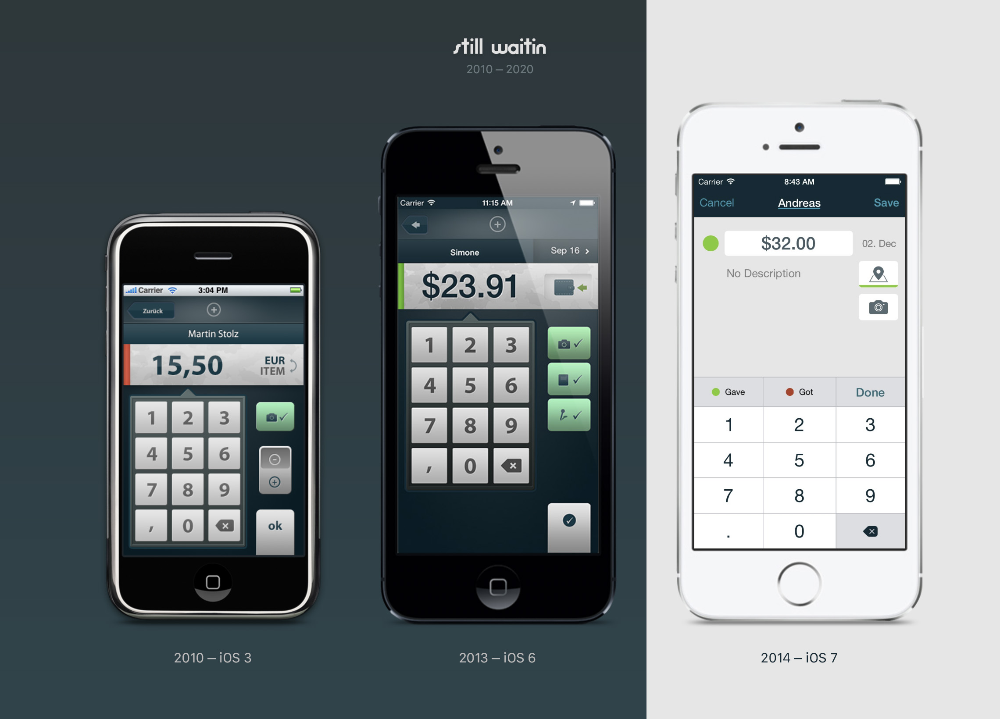
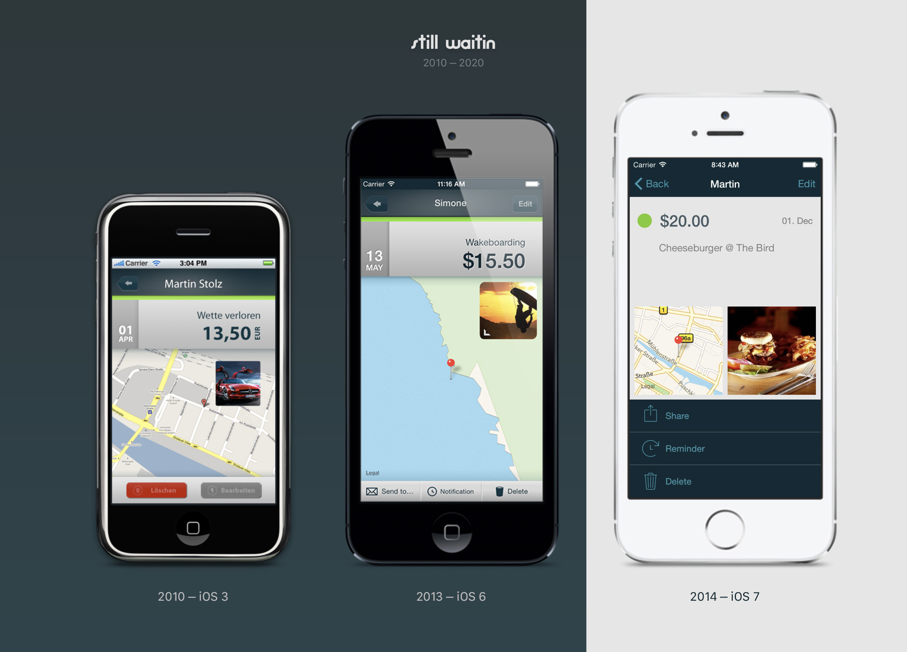

# stillwaitin-app
The still waitin app source code - active in the App Store from 2010-2020.

### App Description:

Keep track of your cash financials. Never forget about money that you lent to or got from friends, family, colleagues or customers. No matter the amount. Get a push reminder at the day & time of your choice or send out a formatted email about open debts to your contacts, so they don't forget either.

### Background

This app was originally written for iOS3. That's before GCD & ARC was available, which were released for iOS4 & iOS5 respectively. That's also before the first Retina display of the iPhone 4 or much newer iOS features like Dark Mode or the Dynamic Island. Let alone Swift or SwiftUI.

It's an app, which @martinstolz and me wrote together as a side project to learn iOS development. So don't take this as an architectural marvel, but instead as a small window into the history of iOS development. We continued to maintain and update it for another 10 years until we took it out of the appstore in 2020. 

### Source code

We are open sourcing the source code of two versions of the app here. Both still compile and run on today's Xcode 15:

#### Version 2.4 (from 2020)

- The most recent released version. A fairly modern iOS app in comparison to version 1.5.
- It has an iOS 7 redesign, iPhone X support, dark mode and many additional features.
- Persistence is handled by a `Realm` database.
- LOC: roughly ~9000* lines
    - notably not that much more than v1.5, even though it has many more features.
- Open source dependencies:
    - `ZoomInteractiveTransition` from https://github.com/DenTelezhkin/ZoomInteractiveTransition

#### Version 1.5 (from 2012)

- This version still uses manual reference counting.
    - see the 177 manual `retain/release` calls.
- Contains `@2x` assets
    - (the iPhone 4 came out on `06/2010`)
- The persistence is simply based on `NSUserDefaults`.
- LOC: roughly ~7500* lines
- Open source dependencies:
    - `DDAnnotationView` from https://github.com/digdog/
    - `UIColor+ColorWithHex` from https://github.com/pixeldock/PDUtils
    - `UIView+position` from https://github.com/tylerneylon/moriarty

`*` LOC measured in the `/Classes` directory by calling: `find . -name '*.m' | xargs wc -l | sort` minus any externally pulled in dependencies.

### Changelog

See the [`CHANGELOG.md`](CHANGELOG.md) for a full list of changes between these two versions.

### Screenshots

| Data entry screen  | Entry details screen |
| ------------- | ------------- |
|   |   |
